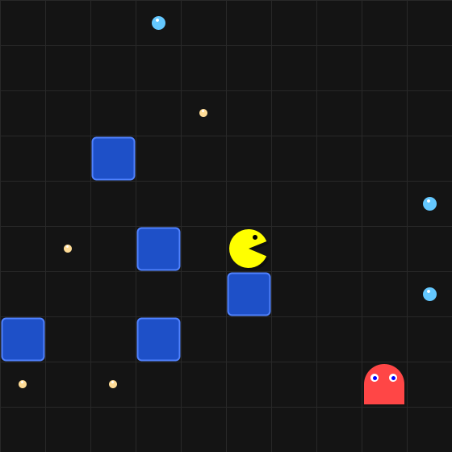

# Pac-Man-inspired Java game

A small desktop game by **Albin Tharayil**, built with Java Swing and Java2D as a student programming project.



## Features

- A 10 x 10 grid with randomly generated walls, pellets and power-ups.
- Animated player movement, a moving mouth, ghost effects and floating score labels.
- A timer-driven rendering loop and queued keyboard input.
- Ghosts that increasingly chase the player as levels progress and flee during a power-up.
- Scoring, level progression and New Game / Quit menu actions.

This is a simplified grid game inspired by Pac-Man, rather than a recreation of the original arcade maze. Ghosts take a turn after the player moves; holding a movement key produces repeated moves.

## Run the game

Install a **JDK 17 or newer**. A graphical desktop is required to play. There are no external libraries or image assets to install.

Download this repository using **Code > Download ZIP**, extract it, and open a terminal in the extracted folder:

```sh
javac --release 17 -encoding UTF-8 -d out PacMan.java
java -cp out PacMan
```

Use **W/A/S/D** or the **arrow keys**. Collect all pellets to reach the next level. Blue power-ups protect the player for five subsequent moves and make ghosts flee. Contact with a ghost without protection ends the game and resets it.

## Check the project

The dependency-free checks cover 900 seeded boards, reachable cells, unique ghost starting positions, collisions, power-up duration, resets, level progression, movement and offscreen rendering.

```sh
javac --release 17 -encoding UTF-8 -Xlint:all -d out PacMan.java PacManSmokeTest.java
java "-Djava.awt.headless=true" -cp out PacManSmokeTest
```

The preview above is rendered directly from the game code and saved as an SVG. To generate a fresh PNG preview, add `screenshot.png` to the last command.

## Implementation

The project uses a main `PacMan` class with `GamePanel` and `FloatLabel` inner classes. It demonstrates Swing events, custom drawing, a game loop, coordinate-based collision checks, collections and rule-based ghost movement.

## Development notes

Originally developed as a student project in 2024. The portfolio version includes fixes for collisions, keyboard focus, power-up duration, resets and board generation, plus run instructions and regression checks.

Possible future improvements include a separate game-state model, a typed `Ghost` class in place of coordinate arrays, maze-based levels, stronger pathfinding, sound and a saved high-score table.

This is an unofficial educational project and is not affiliated with the original game's creators.
